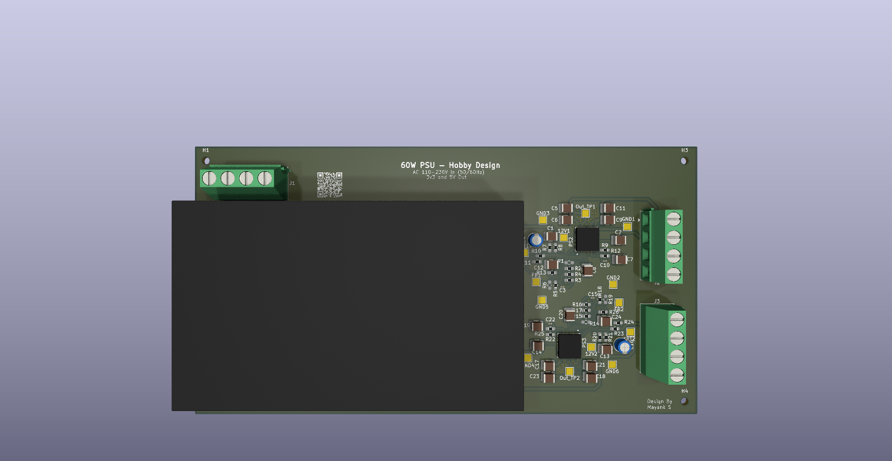
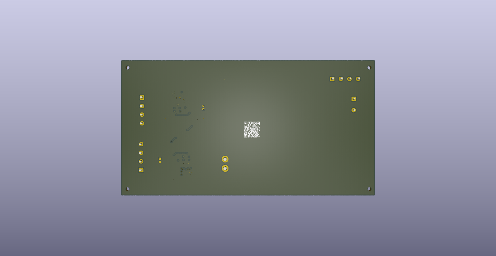

# Universal PSU - 60W Dual Output Power Supply

A compact, universal input AC-DC power supply designed for hobby electronics projects. Features dual regulated outputs (3.3V and 5V) with up to 6A per rail, built-in protection, and global voltage compatibility.



## Features

- **Universal Input**: 110-230V AC, 50/60Hz compatible
- **Dual Outputs**: 
  - 3.3V @ 6A max
  - 5V @ 6A max
- **Total Power**: 60W peak
- **Protection**: Built-in overcurrent protection (OCP) and thermal shutdown
- **Compact Design**: Optimized for hobby electronics applications
- **Fixed Outputs**: Stable, regulated voltages

## Specifications

| Parameter | Value |
|-----------|-------|
| Input Voltage | 110-230V AC |
| Input Frequency | 50/60 Hz |
| Output 1 | 3.3V @ 6A |
| Output 2 | 5V @ 6A |
| Total Power | 60W (peak) |
| Protection | OCP, Thermal Shutdown |

## Key Components

- **AC-DC Converter**: IRM-60-12 (60W, universal input)
- **DC-DC Regulators**: TLVM14406RCHR (dual outputs)
- **4-layer PCB** for improved thermal performance and signal integrity

## Project Structure

```
universal-psu/
├── Exports/                    # Production files
│   ├── Gerber/                # Manufacturing files
│   ├── universal-psu.pdf      # Schematic PDF
│   ├── universal-psu.csv      # Bill of Materials
│   ├── universal-psu.net      # Netlist
│   ├── universal-psu-3dview-top.png
│   └── universal-psu-3dview-bot.png
├── libraries/                  # Custom KiCad libraries
│   ├── 3dmodels/              # STEP models
│   ├── footprints/            # Custom footprints
│   └── symbols/               # Custom symbols
├── Subsheets/                 # Hierarchical schematic sheets
│   ├── DC_DC_Converter_3v3.kicad_sch
│   └── DC_DC_Converter_5V.kicad_sch
├── universal-psu.kicad_pcb    # PCB layout
├── universal-psu.kicad_sch    # Main schematic
└── universal-psu.kicad_pro    # KiCad project file
```

## PCB Details

- **Layers**: 4-layer stackup
- **Dimensions**: [TBD - check PCB file]
- **Mounting**: [TBD - check hole spacing]

## Board Views

### Top View


### Bottom View


## Manufacturing

### Status
🚧 **Currently in manufacturing** - First prototype batch

### Files
Ready-to-manufacture Gerber files are available in `Exports/Gerber/`

The board uses standard 4-layer stackup compatible with most PCB manufacturers (JLCPCB, PCBWay, OSH Park, etc.)

## Assembly

1. **Safety First**: This design works with mains voltage (110-230V AC). Only assemble if you have experience with high-voltage circuits.
2. Solder surface-mount components first (use hot air or reflow)
3. Install through-hole connectors
4. Inspect for solder bridges, especially around the AC-DC converter
5. Test continuity before applying power

⚠️ **WARNING**: This board handles mains voltage. Improper assembly or use can result in electric shock, fire, or death. Ensure proper insulation and enclosure before use.

## Testing

- [ ] Visual inspection for solder bridges
- [ ] Continuity test (power off)
- [ ] Initial power-on with current-limited supply
- [ ] Output voltage verification (3.3V, 5V)
- [ ] Load testing (gradual increase to 6A per rail)
- [ ] Thermal testing under full load

## Known Limitations

- Fixed output voltages (not adjustable)
- No output enable/disable control
- Maximum 6A per rail (60W total shared between outputs)

## Future Improvements

- [ ] Increase power capacity (>60W)
- [ ] Additional output voltages (12V, adjustable rail)
- [ ] Improved PCB layout for better thermal performance
- [ ] Smaller form factor
- [ ] Custom 3D-printed enclosure (design in progress)
- [ ] Output enable controls
- [ ] LED status indicators

## Development Tools

- **KiCad Version**: 8.x (recommended)
- **Design Software**: KiCad EDA
- **3D Models**: STEP files included in `libraries/3dmodels/`

## Bill of Materials

See `Exports/universal-psu.csv` for complete BOM with part numbers and suppliers.

## Schematic

Full schematic is available as PDF: `Exports/universal-psu.pdf`

## Contributing

Contributions welcome! Areas of interest:
- Layout optimization
- Additional output options
- Enclosure design
- Testing and validation feedback

Please open an issue or pull request with your suggestions.

## License

This project is licensed under the **CERN Open Hardware License v2 - Strongly Reciprocal (CERN-OHL-S-2.0)**.

You are free to:
- Use this design commercially or non-commercially
- Modify and distribute the design
- Create and sell products based on this design

Under the conditions that:
- You share modifications under the same license
- You provide attribution
- You include the license text

See [LICENSE](LICENSE) file for full details.

## Safety Disclaimer

⚠️ **DANGER - HIGH VOLTAGE**

This device operates at mains voltage (110-230V AC) which can be **LETHAL**. 

- Only build this if you understand electrical safety
- Use proper insulation and enclosure
- Never operate the board exposed
- Comply with local electrical codes and regulations
- Consider having the design reviewed by a qualified electrical engineer
- Not intended for medical, safety-critical, or life-support applications

**The author assumes no liability for injury, death, property damage, or any other consequences of using this design.**

## Credits

**Design by**: Mayank S

**Date**: December 2025

## Contact

For questions, issues, or collaboration:
- Open an issue on GitHub
- Check the discussions tab

---

**Project Status**: 🟡 Prototype - In Manufacturing

*Star ⭐ this repo if you find it useful!*
