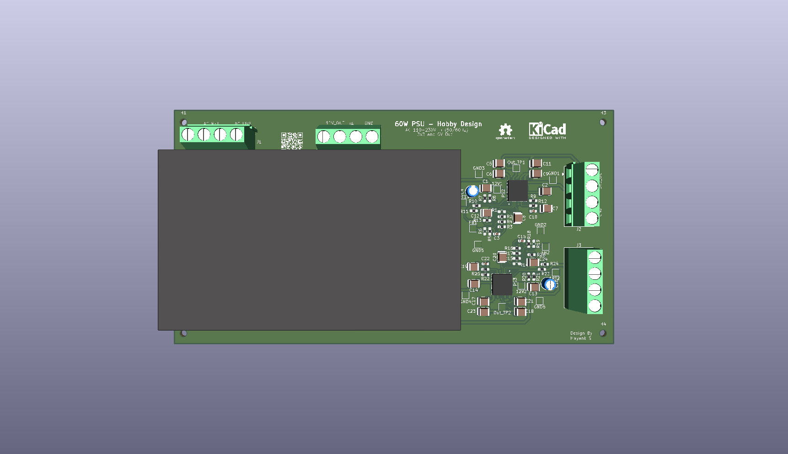
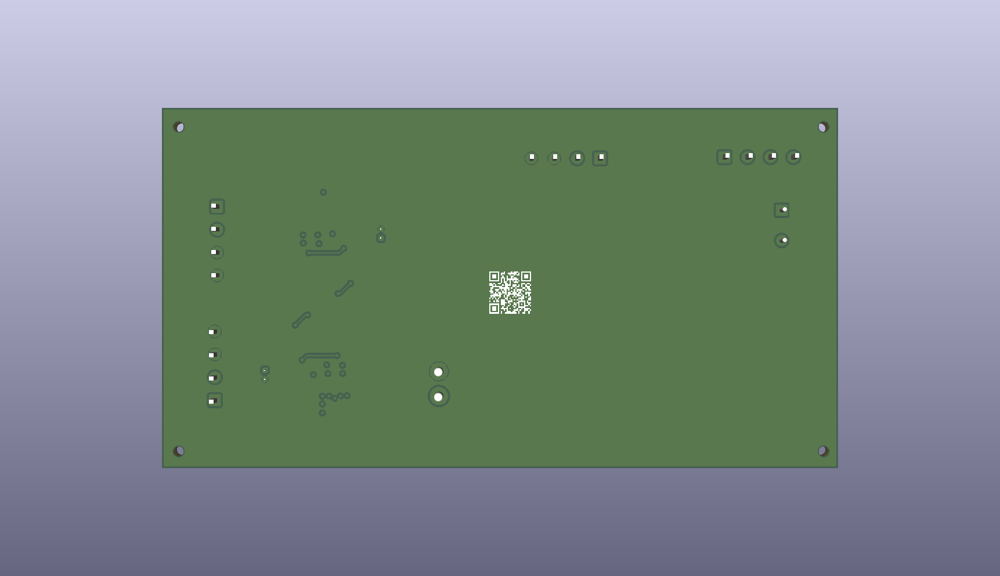

# Universal PSU — 4A Dual-Output Power Supply


A compact mains-input dual-output bench supply built around an isolated AC-DC brick and two integrated buck modules. Provides clean, regulated 5 V and 3.3 V rails for hobby electronics — bench bringup, MCU dev boards, sensors, LEDs, and small actuator loads.

<p align="center">
  
  
</p>

---

## Why I Built This

I had a drawer full of mismatched wall-warts — one for each hobby project, each a different voltage, each with the polarity barrel I never have on hand. I wanted a single, always-on bench supply that I could leave plugged in and tap into for anything I'm prototyping: ESP32s, Pis, sensor breakouts, the Telegram-controlled lights board, whatever.

This was also a deliberate learning project on two fronts:

- **4-layer PCB layout for power applications** — getting the ground plane right, thermal management on the regulator footprints, and clean current return paths in a real-world design rather than a textbook example.
- **Mains-isolated module integration** — using a certified AC-DC brick lets me keep the dangerous side fully encapsulated while still building a useful, mains-powered project. A natural stepping stone before I take on a discrete flyback design later.

---

## Initial Requirements

These were the spec points I wrote down before any design work. The "Outcome" column shows what actually shipped.

| # | Requirement | Target | Outcome |
|---|---|---|---|
| 1 | Universal AC input | 110–230 V AC, 50/60 Hz | ✅ Met (IRM-60-15) |
| 2 | Output rail A | 5 V regulated | ✅ Met |
| 3 | Output rail B | 3.3 V regulated | ✅ Met |
| 4 | Continuous current per rail | 6 A | ⚠️ **4 A** — part ordered was TLVM14406 (4 A), not a 6 A variant. Sufficient for intended loads, scope kept. |
| 5 | Total power budget | ~60 W | ✅ Met (IRM-60-15 = 60 W headroom; DC-DC stage caps actual deliverable lower) |
| 6 | Form factor | Compact, no specific dimensions | ✅ 150 × 80 mm, 4-layer |
| 7 | Output protection (OCP, OVP) | TVS + fuse on outputs | ❌ **Missed in V1** — see [MkII Wishlist](#mkii-wishlist) |
| 8 | Status LEDs | Per-rail power-good indicators | ❌ **Missed in V1** — see [MkII Wishlist](#mkii-wishlist) |
| 9 | Reliability target | 3–4 years continuous service | TBD post-test |

---

## Specifications

| Parameter | Value |
|---|---|
| Input voltage | 110–230 V AC |
| Input frequency | 50 / 60 Hz |
| Intermediate rail | 15 V DC (internal only, see [Future Options](#future-options)) |
| Output 1 | 5 V @ 4 A |
| Output 2 | 3.3 V @ 4 A |
| Total output power | ~33 W deliverable from DC-DC stage<br>(60 W brick headroom) |
| PCB | 4-layer FR-4, 1.6 mm |
| Dimensions | 150 × 80 mm |
| Mounting | 4× M2 corner holes |
| Connectors | 4× 4-pin screw terminal blocks |

---

## Architecture

```
   AC Mains              Isolated brick           DC-DC stage              Outputs
  ┌─────────┐         ┌──────────────┐        ┌──────────────┐         ┌─────────┐
  │ 110-230 │────────▶│  IRM-60-15   │───15V─▶│ TLVM14406 #1 │────5V──▶│  J3     │
  │  V AC   │         │   60W AC-DC  │   │    └──────────────┘         └─────────┘
  └─────────┘         └──────────────┘   │    ┌──────────────┐         ┌─────────┐
                                         └───▶│ TLVM14406 #2 │────3.3V▶│  J4     │
                                              └──────────────┘         └─────────┘
```

The mains side is fully handled by the certified Mean Well IRM-60-15 brick. Everything on the PCB downstream is low-voltage DC, so the layout focused on thermal performance, ground-plane integrity, and switching-loop minimization rather than mains-side concerns.

---

## Key Components

| Reference | Part | Function |
|---|---|---|
| PS1 | Mean Well IRM-60-15 | 60 W universal-input AC-DC brick, 15 V output, fully isolated |
| PS2 | TI TLVM14406RCHR | Integrated 4 A SWIFT buck module, configured for 5 V |
| PS3 | TI TLVM14406RCHR | Integrated 4 A SWIFT buck module, configured for 3.3 V |
| J1–J4 | 4-pin screw terminals | Mains input, intermediate, and two output rails |

### Why the IRM-60 + TLVM14406 combo?

- **AC-DC brick over discrete flyback** — I wanted a reliable, working solution I could trust to leave running for years, without first having to learn off-line converter design, transformer winding, EMI compliance, and creepage/clearance. The IRM-60 is certified, isolated, and lets me focus the project on the DC-DC stage.
- **TLVM14406 over discrete switcher + inductor** — I'd worked with this family before. The integrated module collapses the inductor selection, compensation network design, and layout-critical switching loop into a known-good footprint. Fast path to a board that works.

---

## Connector Pinout

All four screw terminals share the same convention:

| Pin | Function |
|---|---|
| 1 | Power (V+) |
| 2 | Power (V+) |
| 3 | GND |
| 4 | GND |

Doubling power and ground pins lets each rail handle its rated current without exceeding terminal current limits and gives a cleaner mechanical termination for thicker wires.

| Connector | Use |
|---|---|
| J1 | AC mains input (Live / Neutral / Earth — see silkscreen) |
| J2 | 15 V intermediate (test point only — not for external loads in V1) |
| J3 | 5 V output |
| J4 | 3.3 V output |

---

## Repository Structure

```
universal-psu/
├── Exports/
│   ├── Gerber/                       # Production gerbers + drill files
│   ├── Photos/                       # Real PCB photos (added after assembly)
│   │   └── Testing/                  # Bench test photos & scope captures
│   ├── schematic.pdf                 # Full schematic export
│   ├── universal-psu-3dview-top.png  # PCB 3D render — top
│   ├── universal-psu-3dview-bot.png  # PCB 3D render — bottom
│   ├── universal-psu_bom.csv         # Bill of materials
│   ├── universal_psu_gerbers.zip     # Zipped gerbers for fab upload
│   └── universal-psu.net             # Netlist
├── Subsheets/
│   ├── DC_DC_Converter_5V.kicad_sch  # 5 V rail subsheet
│   └── DC_DC_Converter_3v3.kicad_sch # 3.3 V rail subsheet
├── libraries/                        # Custom KiCad symbols, footprints, 3D models
├── universal-psu.kicad_pro           # KiCad project
├── universal-psu.kicad_sch           # Top-level schematic
├── universal-psu.kicad_pcb           # PCB layout
├── LICENSE                           # CERN-OHL-P-2.0
└── README.md
```

---

## Bringup & Testing

> **Status:** PCBs back from fab, assembly in progress. Bringup test results will be posted in this section as they're collected.

### Planned bringup procedure

1. **Visual inspection** — solder bridges, especially around the AC-DC module and the screw terminal footprints
2. **Continuity check (power off)** — input-to-output isolation, no shorts on either rail
3. **Mains-up with no DC-side load** — verify 15 V intermediate rail comes up cleanly from the IRM-60 brick
4. **DC-DC bringup, no load** — verify 5 V and 3.3 V come up to spec (sanity-check the feedback divider math against measurement; resistor values to be verified during this step)
5. **Light load test** — 100 mA per rail, check ripple on a scope
6. **Stepped load test** — 0.5 A → 1 A → 2 A → 3 A → 4 A per rail, log:
   - DC output voltage (line/load regulation)
   - Output ripple (peak-to-peak)
   - Brick case temperature
   - TLVM14406 case temperature (thermal cam)
   - Input current draw (for a rough efficiency number)
7. **Thermal soak** — full load on both rails for 1 hour, log temperatures every 5 minutes

### Test results

*To be added in `Exports/Photos/Testing/` — scope captures, thermal images, and a bench-test summary table.*

| Test | Target | Measured | Notes |
|---|---|---|---|
| 5 V rail accuracy | 4.95 – 5.05 V | _TBD_ | |
| 3.3 V rail accuracy | 3.25 – 3.35 V | _TBD_ | |
| 5 V ripple @ 4 A | < 50 mV pp | _TBD_ | |
| 3.3 V ripple @ 4 A | < 50 mV pp | _TBD_ | |
| Brick temp @ full load | < 70 °C case | _TBD_ | |
| TLVM14406 temp @ 4 A | < 85 °C case | _TBD_ | |
| Line regulation | < 1 % | _TBD_ | |
| Load regulation | < 2 % | _TBD_ | |

---

## When To Use This Board

**Good fit:**
- Powering MCU dev boards (ESP32, RP2040, STM32 Nucleo, Pi Pico)
- Sensor breakouts, LCD modules, small displays
- LED strips and controllers (within 4 A budget)
- General benchtop hobby work where 5 V and 3.3 V are needed simultaneously

**Not a good fit:**
- Motor drives or anything inductive that kicks back significantly (no protection on V1)
- Audio circuits (no LC post-filtering for low-noise applications)
- Safety-critical or always-on industrial use (fuses and TVS missing on V1)
- Loads above 4 A continuous per rail

---

## Future Options

- **Expose 15 V intermediate as a third output** — already present internally, just needs a connector. Useful for op-amp circuits, fan drives, or any project that wants a higher rail.
- **Output protection** — eFuse or polyfuse + TVS on each output rail.
- **Per-rail status LEDs** — power-good indicators tied to the TLVM14406 PG output.
- **3D-printed enclosure** — open-frame is fine for the bench, but a printed case would make this safer to leave plugged in long-term.

---

## MkII Wishlist

Honest list of what V1 missed that V2 should fix:

1. **Output protection** — no TVS, no fuses, no eFuses. A short on either output goes directly to the buck module's internal protection only.
2. **Status LEDs** — no visible indication that either rail is alive.
3. **Mounting hole placement** — corner holes are too close to the board edge, making the board awkward to mount in any standard enclosure. V2 should use rounded corners and proper standoff offsets.
4. **Silkscreen labeling** — connector pin functions need clearer markings on the board face.
5. **15 V tap connector** — already designed in, just needs a header.

---

## Manufacturing

Boards fabricated as standard 4-layer FR-4. Gerbers in `Exports/Gerber/` are compatible with JLCPCB, PCBWay, OSHPark, and similar fab houses.

**Fab specs used:**
- 4-layer, 1.6 mm FR-4
- 1 oz copper outer + inner
- ENIG surface finish recommended for finer pitch parts
- Default solder mask, white silkscreen

---

## Safety

> ⚠️ **DANGER — MAINS VOLTAGE**
>
> This board operates at 110–230 V AC. The mains-side energy can be lethal.
>
> The mains side is encapsulated inside the certified IRM-60-15 brick — no exposed mains-voltage traces exist on the PCB itself once the brick is mounted. However, the screw terminal carrying mains input (J1) and the brick's own input pins are exposed and must be enclosed before powering up.
>
> - Never operate without proper insulation around J1 and the brick's input side
> - Do not bypass or modify the AC-DC brick
> - Use a current-limited isolation transformer for first power-on if you have one available
> - Comply with local electrical codes
> - Not for medical, life-support, or safety-critical use
>
> **The author assumes no liability for injury, death, or property damage.**

---

## License

This project is licensed under the **CERN Open Hardware Licence Version 2 — Permissive (CERN-OHL-P-2.0)**.

You are free to:
- Use, modify, and distribute the design — commercially or non-commercially
- Create derivative works under any license you choose
- Use without sharing modifications back upstream

You must:
- Retain the original license notice and attribution

See [LICENSE](LICENSE) for the full text.

---

## Used By

This board powers the following projects in the same author's portfolio:
- [PC_and_Light_Controller](https://github.com/HighCarlSagan/PC_and_Light_Controller) — Telegram-controlled UPS button + LED switching

---

## Author

**Mak (Mayank Shrivastava)**
[github.com/HighCarlSagan](https://github.com/HighCarlSagan)

Designed: December 2025 · Boards back: April 2026 · Bringup: in progress
